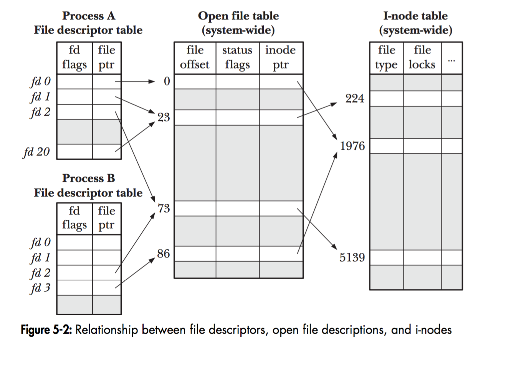
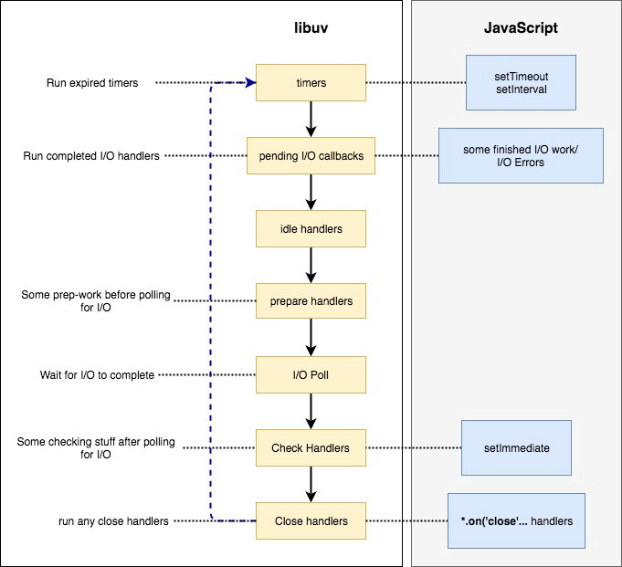

**Different Aspects of Event Loop**

*Topics are discussed in no particular order, and are a collection of snippets
from various sources and my understanding of the same.*

Timer queue is actually a priority queue implemented with a min heap by libuv.

So, in accordance with the structure of a min-heap, the element with the min
value always stays at the top and therefore at any point in time the first
element in the queue(root element in the min heap) is the element with the min
value.

The value of each element in this timer-queue of event loop is the time at which
it expires. So for example, if you have set a timeout with the duration being
500 milliseconds, then the the value of that element in the timer queue would be
the current time + 500ms. So, by design the timeouts closest to expiry would be
at the start of the queue(top of the heap).

At the timers phase of the event loop, Node will check the timers heap for
expired timers/intervals and will call their callbacks respectively. 

SetInterval works in a similar manner in the sense that after each execution of
it, a new element with a timestamp having the value of current time plus
interval duration is added back to the queue.

**Node uses libuv underneath to take care of this. While setTimeout has some
internal managing of its own, it ends up using the uv_timer_t facility provided
by libuv.**

**Let’s assume that the only thing the event loop is doing is the timer. libuv
will calculate the poll timeout, which will actually be the timer's due time (in
this example). Then the event loop will block for i/o by using the appropriate
syscall (epoll_wait, kevent, etc). At that point it's up to the kernel to decide
what to do, but the current thread of execution is blocked until the kernel
wakes it up again, so there is no used CPU here, because nothing is happening.**

**Once the timeout expires, the aforementioned syscall will return, and libuv
will process the due timers and i/o.**

In simpler terms, the timer would be first set, then the event loop would wait
for any I/O in the next phase until the timer expires in which case it would
loop through the remaining phases of the current loop to reach the timer phase
again where it would execute the expired timer callbacks.

**If an immediate timer is queued from inside an executing callback, that timer
will not be triggered until the next event loop iteration.**

**Bindings**:

Normally code written in different languages cannot communicate with each other.
Not without bindings. Bindings, as the name implies, are glue codes that “bind”
one language with another so that they can talk with each other. In this case
(Node.js), bindings simply expose core Node.js internal libraries written in
C/C++ (V8, Libuv, c-ares, zlib, OpenSSL, http-parser, etc.) to JavaScript. One
motivation behind writing bindings is code reuse: if a desired functionality is
already implemented, why write the entire thing again, just because they are in
different languages? Why not just bridge them? Another motivation is
performance: system programming languages such as C/C++ are generally much
faster than other high-level languages (e.g. Python, JavaScript, Ruby, etc.).
Therefore it might be wise to designate CPU-intensive operations to codes
written in C/C++, for example.

**C/C++ Addons**: Bindings only provide glue code for Node.js’ core internal
libraries, i.e. zlib, OpenSSL, c-ares, http-parser, etc. If you want to include
a third-party or your own C/C++ library in your application, you would have to
write the glue code for that library yourself. These glue code you write are
called addons. Think of bindings and addons as **bridges** between your
JavaScript code and Node.js’ C/C++ code.

A brief explanation of how the node ecosystem works with bindings for
fs.readFile

<https://github.com/libuv/help/issues/62#issuecomment-424431606>

When the event loop enters the **poll** phase, 

*If the poll queue is not empty*, the event loop will iterate through its queue
of callbacks executing them synchronously until either the queue has been
exhausted, or the system-dependent hard limit is reached. By default, it will
keep on waiting at this stage for any pending IO operations to complete (for
example, a fs.readFile() has not completed yet)

Now, if a timer is set it would wait for the maximum time until the soonest
timer's threshold is reached, after which it would wrap back to
the **timers** phase to execute those timers' callbacks. During this wait time
for a set timer to expire, if other callback(s) are added to the poll queue,
then it would start executing them. So the event loop would only reach the timer
phase only after all the callbacks in the poll queue have been executed.
[Consider the scenario of waiting on http request, if there are no other tasks
to be executed by the event loop then it keeps on waiting at this phase for
request, that’s why the event loop remains active and the node process doesn’t
exit. And even if some other tasks come through, say a timer has expired it
would run those tasks as per the set algorithm and then would again come back to
this busy waiting phase].

And finally irrespective of a timer being set or not, if *the poll queue becomes
empty*, and if there are scripts that have been scheduled by setImmediate(),
then the event loop will end the poll phase and continue to the *check phase* to
execute those scheduled scripts.

**check**

This phase allows a person to execute callbacks immediately after
the **poll** phase has completed. If the **poll** phase becomes idle and scripts
have been queued with setImmediate(), the event loop may continue to
the **check** phase rather than waiting.

setImmediate() is actually a special timer that runs in a separate phase of the
event loop. It uses a libuv API that schedules callbacks to execute after
the **poll** phase has completed.

Generally, as the code is executed, the event loop will eventually hit
the **poll** phase where it will wait for an incoming connection, request, etc.
However, if a callback has been scheduled with setImmediate() and
the **poll** phase becomes idle, it will end and continue to the **check** phase
rather than waiting for **poll** events.

**close callbacks**

If a socket or handle is closed abruptly (e.g. socket.destroy()),
the 'close' event will be emitted in this phase. Otherwise it will be emitted
via process.nextTick().

A real world use-case for *Process.nextTick()*:

*const server = net.createServer(() =\> {}).listen(8080);*

*server.on('listening', () =\> {});*

When only a port is passed, the port is bound immediately. So,
the 'listening' callback could be called immediately. The problem is that
the *.on('listening')* callback will not have been set by that time.

To get around this, the 'listening' event is queued in a nextTick() to allow the
script to run to completion. This allows the user to set any event handlers they
want.

There are two main reasons as to why someone would use *nextTick()* over
*setImmediate()*:  
1. Allow users to handle errors, cleanup any then unneeded resources, or perhaps
try the request again before the event loop continues.  
2. At times it's necessary to allow a callback to run after the call stack has
unwound but before the event loop continues.

An OS maintains a list of PCB – Process control block, which is a structure that
holds the context for each of it’s own processes.

Each process has it’s own PCB.

A PCB has a file descriptor table. Each row in that table has a file descriptor
no (index), and a pointer to the “file structure” for the concerned resource.

A “file structure” stores the details to the location of the resource.  
A “resource” can be a file, socket, terminal, pipes, devices.

Between each phase, libuv needs to communicate the results of the phase [If it’s
an IO phase, then the to the higher layers of Node architecture (which means
JavaScript). Each time this happens, any *process.nextTick* callbacks and other
microtask callbacks will be executed.

In truth, the Event Loop does not actually maintain a queue. Instead, it has a
collection of file descriptors that it asks the operating system to monitor,
using a mechanism like epoll (Linux), kqueue (OSX), event ports (Solaris),
or [IOCP](https://msdn.microsoft.com/en-us/library/windows/desktop/aa365198.aspx) (Windows).
These file descriptors correspond to network sockets, any files it is watching,
and so on. When the operating system says that one of these file descriptors is
ready, the Event Loop translates it to the appropriate event and invokes the
callback(s) associated with that event.

**(1) Who put callback function to event queue?**

Node.js is a libuv "embedder". Node.js uses libuv for (1) platform-independent
(asynchronous) system call support, and (2) its event loop / worker pool
paradigm.

See *nodejs/src/node.cc::Start* for the call to uv_run that drives the libuv
event loop that Node.js uses.

This enters (in Linux) *libuv/src/unix/core.c* where *uv_run* is defined. Note
the call to \*uv__io_poll* within which heads over
to *libuv/src/unix/linux-core.c* where *epoll_pwait\* is issued.

**(2) And is there really only callback function in event queue? how about
result of I/O Operation - The value which will be used in callback function as a
argument value?**

Everything the libuv event loop handles is a "callback". But the callbacks the
libuv event loop invokes (function pointers) are not always the same as the
callbacks in Node.js (JavaScript code). Node.js sometimes (always?) interposes
[places itself between] its own C++ code as callbacks. For
example, *fs.readFile* is converted by Node.js into several *uv_fs_X* operations
under the hood, and only after stat, open, potentially many read's,
and close will the user's JS callback be invoked. Each of those FS operations
runs asynchronously and spends some time on the event loop. C++-land Node.js
libraries (and I believe the code re-enters the JS fs library along the way?)
manage all that for you.

To see how code moves from Node.js JavaScript into Node.js C++, take a look for
example *at node/src/node_file.cc::Initialize*. These calls tell V8 how to map
from JS calls into the appropriate Node.js C++ bindings.

When it comes to libuv, there are 7 distinguishable phases. They are,

**Timers** — Expired timer and interval callbacks scheduled
by setTimeout and setInterval will be invoked.

**Pending I/O callbacks** — Pending Callbacks of any completed/errored I/O
operation to be executed here.

Idle **handlers** — Perform some libuv internal stuff.

Prepare **Handlers** — Perform some prep-work before polling for I/O.

I/O Poll — Optionally wait for any I/O to complete.

Check **handlers** — Perform some post-mortem work after polling for I/O.
Usually, callbacks scheduled by setImmediate will be invoked here.

Close **handlers** — Execute close handlers of any closed I/O operations (closed
socket connection etc.)

**Design overview — libuv documentation**

**Design overview**

libuv is cross-platform support library which was originally written
for [Node.js](https://nodejs.org/). It’s designed around the event-driven
asynchronous I/O model.

The library provides much more than a simple abstraction over different I/O
polling mechanisms: *‘handles’* and *‘streams’* provide a high level abstraction
for sockets and other entities; cross-platform file I/O and threading
functionality is also provided, amongst other things.

Here is a diagram illustrating the different parts that compose libuv and what
subsystem they relate to:

**Handles and requests**

libuv provides users with 2 abstractions to work with, in combination with the
event loop: handles and requests.

Handles represent long-lived objects capable of performing certain operations
while active. Some examples:

-   A prepare handle gets its callback called once every loop iteration when
    active.

-   A TCP server handle that gets its connection callback called every time
    there is a new connection.

Requests represent (typically) short-lived operations. These operations can be
performed over a handle: write requests are used to write data on a handle; or
standalone: getaddrinfo requests don’t need a handle they run directly on the
loop.

**The I/O loop**

The I/O (or event) loop is the central part of libuv. It establishes the content
for all I/O operations, and it’s meant to be tied to a single thread. One can
run multiple event loops as long as each runs in a different thread. The libuv
event loop (or any other API involving the loop or handles, for that
matter) **is not thread-safe** except where stated otherwise.

The event loop follows the rather usual single threaded asynchronous I/O
approach: all (network) I/O is performed on non-blocking sockets which are
polled using the best mechanism available on the given platform: epoll on Linux,
kqueue on OSX and other BSDs, event ports on SunOS and IOCP on Windows. As part
of a loop iteration the loop will block waiting for I/O activity on sockets
which have been added to the poller and callbacks will be fired indicating
socket conditions (readable, writable hangup) so handles can read, write or
perform the desired I/O operation.

In order to better understand how the event loop operates, the following diagram
illustrates all stages of a loop iteration:

1.  The loop concept of ‘now’ is updated. The event loop caches the current time
    at the start of the event loop tick in order to reduce the number of
    time-related system calls.

2.  If the loop is *alive* an iteration is started, otherwise the loop will exit
    immediately. So, when is a loop considered to be *alive*? If a loop has
    active and ref’d handles, active requests or closing handles it’s considered
    to be *alive*.

3.  Due timers are run. All active timers scheduled for a time before the loop’s
    concept of *now* get their callbacks called.

4.  Pending callbacks are called. All I/O callbacks are called right after
    polling for I/O, for the most part. There are cases, however, in which
    calling such a callback is deferred for the next loop iteration. If the
    previous iteration deferred any I/O callback it will be run at this point.

5.  Idle handle callbacks are called. Despite the unfortunate name, idle handles
    are run on every loop iteration, if they are active.

6.  Prepare handle callbacks are called. Prepare handles get their callbacks
    called right before the loop will block for I/O.

7.  Poll timeout is calculated. Before blocking for I/O the loop calculates for
    how long it should block. These are the rules when calculating the timeout:

    -   If the loop was run with the UV_RUN_NOWAIT flag, the timeout is 0.

    -   If the loop is going to be stopped (uv_stop() was called), the timeout
        is 0.

    -   If there are no active handles or requests, the timeout is 0.

    -   If there are any idle handles active, the timeout is 0.

    -   If there are any handles pending to be closed, the timeout is 0.

    -   If none of the above cases matches, the timeout of the closest timer is
        taken, or if there are no active timers, infinity.

8.  The loop blocks for I/O. At this point the loop will block for I/O for the
    duration calculated in the previous step. All I/O related handles that were
    monitoring a given file descriptor for a read or write operation get their
    callbacks called at this point.

9.  Check handle callbacks are called. Check handles get their callbacks called
    right after the loop has blocked for I/O. Check handles are essentially the
    counterpart of prepare handles.

10. Close callbacks are called. If a handle was closed by calling uv_close() it
    will get the close callback called.

11. Special case in case the loop was run with UV_RUN_ONCE, as it implies
    forward progress. It’s possible that no I/O callbacks were fired after
    blocking for I/O, but some time has passed so there might be timers which
    are due, those timers get their callbacks called.

12. Iteration ends. If the loop was run with UV_RUN_NOWAIT or UV_RUN_ONCE modes
    the iteration ends and uv_run() will return. If the loop was run
    with UV_RUN_DEFAULT it will continue from the start if it’s still *alive*,
    otherwise it will also end.

Important

libuv uses a thread pool to make asynchronous file I/O operations possible, but
network I/O is **always** performed in a single thread, each loop’s thread.

Note

While the polling mechanism is different, libuv makes the execution model
consistent across Unix systems and Windows.

**File I/O**

Unlike network I/O, there are no platform-specific file I/O primitives libuv
could rely on, so the current approach is to run blocking file I/O operations in
a thread pool.

For a thorough explanation of the cross-platform file I/O landscape,
checkout [this post](http://blog.libtorrent.org/2012/10/asynchronous-disk-io/).

libuv currently uses a global thread pool on which all loops can queue work. 3
types of operations are currently run on this pool:

-   File system operations

-   DNS functions (*getaddrinfo* and *getnameinfo*)

-   User specified code via uv_queue_work()

Two things to keep in mind regarding setImmediate in the check phase of the loop
:

-   If the **poll** phase becomes idle and scripts have been queued
    with setImmediate(), the event loop may continue to the **check** phase
    rather than waiting.

-   If an immediate timer is queued from inside an executing callback, that
    timer will not be triggered until the next event loop iteration
