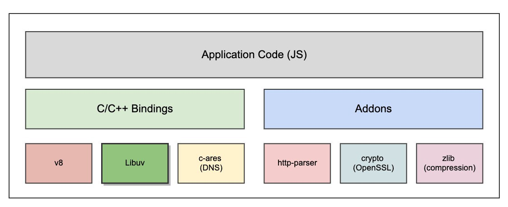
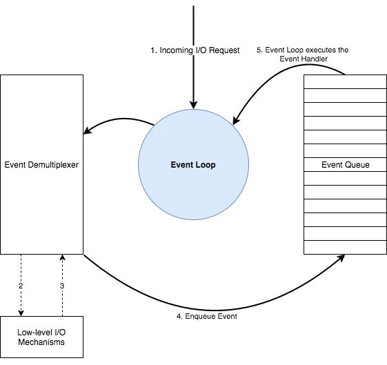

What is Node
------------

Node js is a JS runtime built on V8 JS Engine. When a code runs in browser, the
browser itself is the runtime, in case of node, it is that same runtime. It's
like a container/environment in which a JS Code can run. V8 actually parses and
runs the code in Node js.

Java - JRE - JVM

JS - Node - V8

Node Runtime
------------

A runtime is the provider of the in-built libraries/api that can be used out of
the box, Think of "stdio.h" in C, "fs" module in Node, document model in
Browser, in-built Java functions. Those out-of-the-box offerings plus the actual
engine (JVM/V8) makes the complete runtime. In a compiled language, the source
code usually gets translated to machine code as a whole first and then is run.
In an interpreted language, interpreters are step-by-step executors of source
code, where no pre-runtime translation takes place. Java code is first complied
into a portable format called Bytecode. This bytecode encodes the result of
compiler parsing and performing semantic analysis of things like type, scope,
and nesting depths of program objects, and can be run by any JVM. JVM is the
interpreter which can interpret/execute this code.

In theory, any programming language can be either interpreted or compiled. In
modern programming language implementation, it is increasingly popular for a
platform to provide both options.

Parts of Node
-------------

Node JS is composed of mainly two main parts - 1) V8 and 2) libuv

V8 - is the javascript interepreter which understands and runs the JS code.

libuv - is responsible for node-specific actions like file handling, network
requests, etc. In addition to that, it also implements two important node js
functions, 1) the event loop, and 2) the thread pool. In simple terms, the event
loop is responsible for handling easy tasks like executing call backs and
network I/O while the thread pool is for more heavy work like file access or
compression.

Also V8 is written in C++ and some JS. libuv, is completely written in C++.

In addition to it, there are other libraries which provides other functions in
node, like http-parser lib for parsing http, openSSL for security, zlib for
compression, etc.

Node Execution
--------------

Node js is a process (The reference to the same `process` that you use in code)
having just a single thread. As soon as the node starts running, the following :

-   Initialize Program

-   Execute Top-Level Code (Non-callback immediate codes)

-   Require modules

-   Register event callbacks

-   Start Event Loop. The event loop by itself handles things like callbacks,
    but offloads few of the heavy tasks like the ones mentioned below to the
    thread pool (by default 4 threads are in the pool, max 128):

-   File system APIs, Cryptography, Compression, and DNS lookups.

Node Event Loop
---------------

NodeJS works in an event-driven model which involves an **Event
Demultiplexer** and an **Event Queue**. All I/O requests will eventually
generate an event of completion/failure or any other trigger.

1.  Event demultiplexer receives I/O requests and delegates these requests to
    the appropriate hardware.

2.  Once the I/O request is processed (data from a file is available to be read,
    data from a socket is available to be read, etc.), event demultiplexer will
    then add the registered callback handler for the particular action in a
    queue to be processed. These callbacks are called events and the queue where
    events are added is called the **Event Queue**.

3.  When events are available to be processed in the event queue, they are
    executed sequentially in the order they were received until the queue is
    empty.

4.  If there are no events in the event queue or the Event Demultiplexer has no
    pending requests, the program will complete. Otherwise, the process will
    continue from the first step.

The program which orchestrates this entire mechanism is called the **Event
Loop**.

When we start our Node application, the event loop starts running right away.
Now, the queue handling part of the event loop has multiple phases, and each
phase has its own callback queue. There are mostly four important phases through
which an event loop runs. Each phase resembles a grouping of a certain kind of
tasks.

1.  So, **the first phase takes care of callbacks of expired timers**, for
    example, from the *setTimeout()* function. So, if there are callback
    functions from timers that just expired, these are the first ones to be
    processed by the event loop. If a timer expires later during the time when
    one of the other phases are being processed, then the callback of that timer
    will only be called as soon as the event loop comes back to this first
    phase. And it works like this in all four phases. So, callbacks in each
    queue are processed one by one until there are no ones left in the queue,
    and only then, the event loop will enter the next phase.

>   When you add a timer using setTimeout or an interval using setInterval, Node
>   will add the timer to the timers heap (min-heap is the implementation data
>   structure for priority queue), which is accessed through libuv. At the
>   timers phase of the event loop, Node will check the timers heap for expired
>   timers/intervals and will call their callbacks respectively. If there are
>   more than one timer which were expired (set with the same expiration
>   period), they will be executed in the order they were set.

1.  Next up, **we have I/O polling and execution of I/O callbacks**. So, polling
    basically means looking for new I/O events (file access and networking) that
    are ready to be processed and putting them into the callback queue. This is
    where bulk of the tasks happen.

2.  Next comes, **setImmediate callback which is a special kind of a timer**
    which is guaranteed to run after expired Timers and I/O callbacks in a run
    of the loop.

3.  And the fourth one **is the phase for close callback**. In this phase
    callbacks for all close events are processed, for example when a web server
    shuts down.

Beside these four queues, there are two other queues - **Process.nextTick()**
queue, and other **microtask queue** (which is mainly for resolved promises). If
there are any callbacks in one of these two queues to be processed, node will
start processing the queue immediately **until the queue is empty** between each
individual setTimeout and setImmediate callbacks, even if the timers queue or
the immediates queue is not empty (this behavior is since v11).

*Process.nextTick()* queue is displayed separately from the other four main
queues because it is **not natively provided by the libuv**, but implemented in
Node. *Process.nextTick()* queue has even higher priority over the other
microtasks queue. Although, they both are processed in between two phases of the
event loop when libuv communicates back to higher layers of Node at the end of a
phase.

After a cycle of the loop ends, it's time to decide whether it should exit the
program or not. Node simply checks whether there are any timers or I/O tasks
that are still running in the background, and if there aren't any, then it will
exit the application. But if there are any pending timers or I/O tasks, then it
will continue running the event loop and go straight to the next cycle. So, for
example, when we're listening for incoming HTTP requests we were basically
running an I/O task, and that is why the event loop, and therefore, Node.js,
keeps running and keep listening for new HTTP requests coming in instead of just
exiting the application. Also, when we're writing or reading a file in the
background, that's also an I/O task, and so, it makes sense that the app doesn't
exit.

NodeJS has done its best to do most of the I/O using non-blocking and
asynchronous hardware I/O, but for the I/O types which blocks or are complex to
address, it uses the thread pool. The **Event Demultiplexer**, is not an atomic
entity, but a collection of an I/O processing APIs abstracted by the Libuv and
exposed to the upper layers of NodeJS. It’s not only the event demultiplexer
that libuv provides for Node. Libuv provides the entire event loop functionality
to NodeJS including the event queuing mechanism.

Node Events Workflow
--------------------

There are three components to the event driven architecture that makes it work:

1.  **Event Emitters** – Emits events on fulfillment of certain conditions

2.  **Event Listeners** – Components who waits for certain events to be emitted
    by the above-mentioned event emitters.

3.  **Attached Callback Functions** – The above-mentioned event listeners on
    receiving a certain event would push all the attached callback functions to
    one of the event loop phase queues as per the task type.

You can write your custom event classes using the built-in *event* modules
provided by the node runtime.
